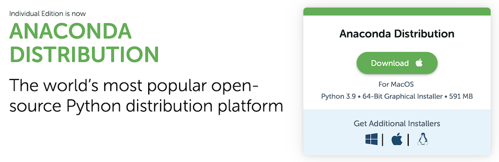
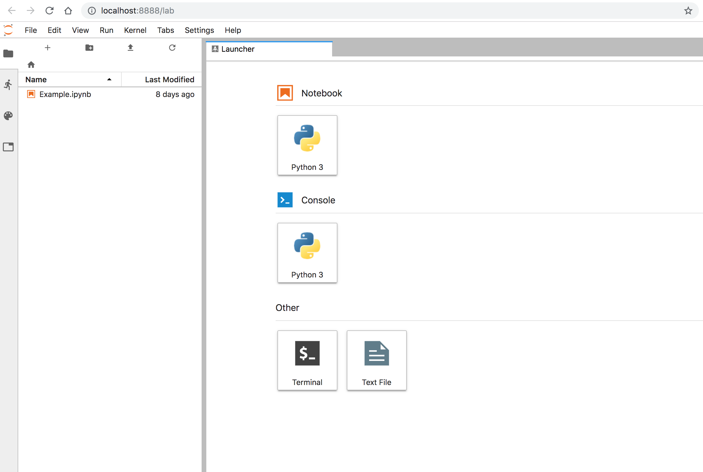
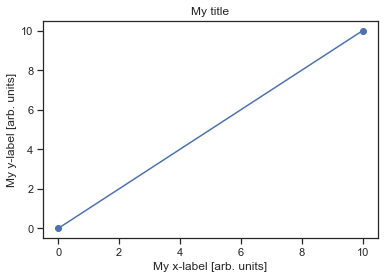
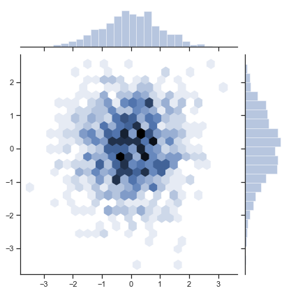
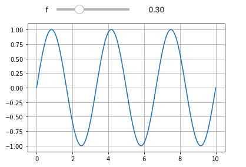
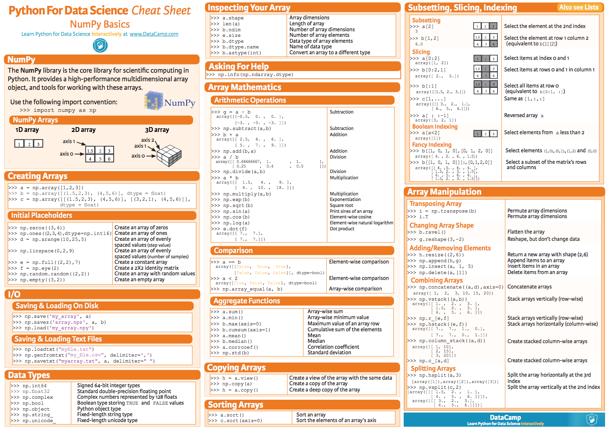
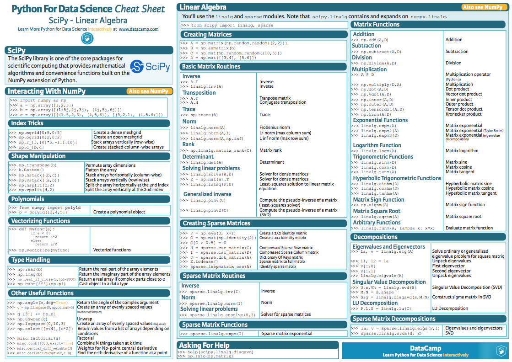
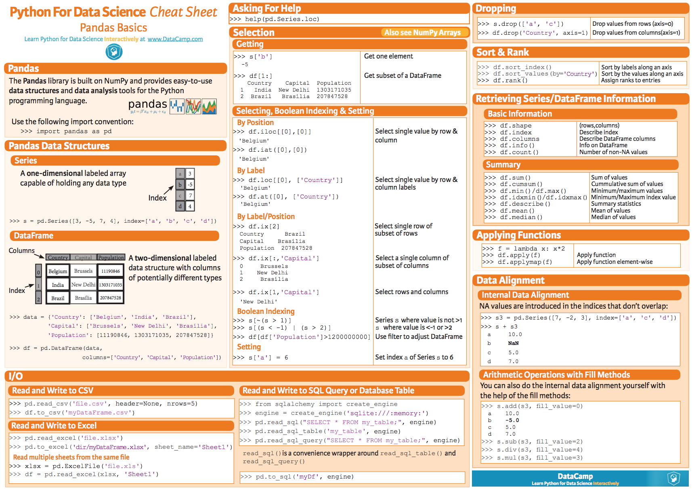
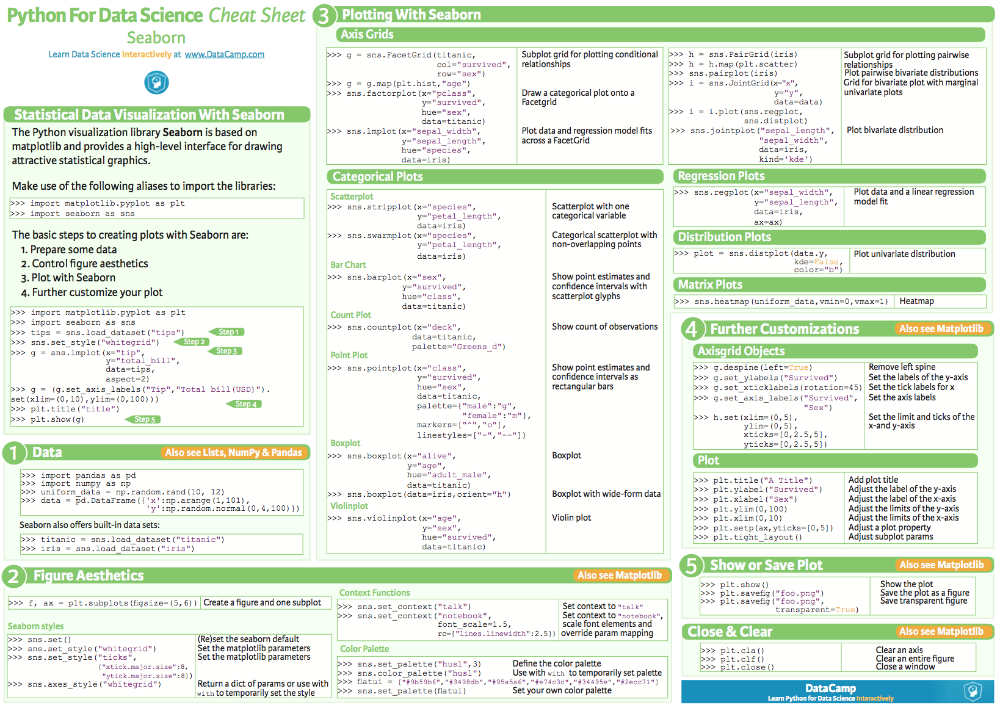
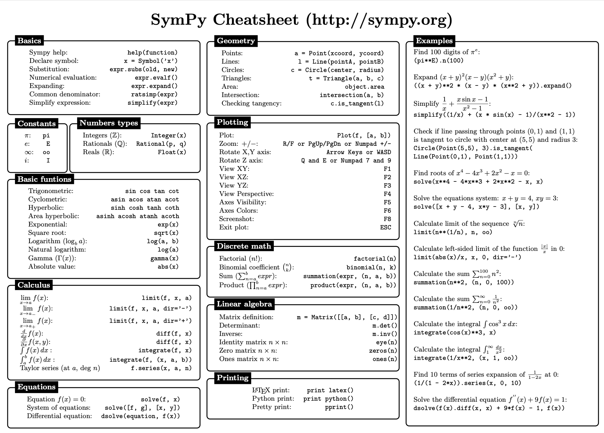

# Hands-On Lattice (and Longitudinal) Calculations using Python - Setup Instructions
---

During the course we will use **Python3** in a **Jupyter notebook** with [JupyterLab](https://jupyterlab.readthedocs.io/en/stable/) and, mostly, the [numpy](https://numpy.org/) and [matplotlib](https://matplotlib.org/) packages. We will explain in the following sections how to install all necessary software on **your laptop**.
A basic knowledge of Python is assumed. If you are not familiar with Python, you can find a few resources to fill the gap in the following sections [a short introduction](#a-very-short-introduction-to-python) section below, where we provided some useful links to get familiar with Python, we will focus on the [software setup](#software-setup). 
In [appendix](#appendix-python-packages) you will find links and cheatsheets for the most common Python packages that will be used during the course.

> **Important:** we kindly ask you to go throw this document **before coming** to CAS, such as to **prepare yourself** (and **your laptop**) for the course. 

---
# A very short introduction to Python
You can find several nice courses, videos and resources on the internet. Here you have a couple of suggestions you can find on YouTube:

<p align="center">
<a href=http://www.youtube.com/watch?v=kqtD5dpn9C8></a> 
&nbsp;&nbsp;&nbsp;&nbsp;
<a href=http://www.youtube.com/watch?v=rfscVS0vtbw></a>
</p>

### Test Python on a web page

If you are not familiar with Python and you have not it installed on your laptop, you can start playing with simple python snippets on the web. Without installing any special software you can connect, 
for example, on [](https://mybinder.org/v2/gh/cerncas/hands-on-python.git/HEAD),
and test the following commands:

```python
import numpy as np

# Matrix definition
Omega=np.array([[0, 1],[-1,0]])
M=np.array([[1, 0],[1,1]])

# Sum and multiplication of matrices
Omega - M.T @ Omega @ M
# M.T means the "traspose of M".

# Function definition
def Q(f=1):
    return np.array([[1, 0],[-1/f,1]])

# Eigenvalues and eigenvectors
np.linalg.eig(M)
```
You can compare and check your output with the ones [here](tests/SimpleTest.ipynb).

---
# Software Setup

In this section we will explain how to install Python and JupyterLab on your laptop.
JupyterLab is a user-friendly environment to work with Python. 
You can find an overview on JupyterLab [here](https://jupyterlab.readthedocs.io/en/stable/).

> If you already have your favorite Python distribution installed on your laptop, including JupyterLab, you might want to skip the [installation](#installation) and jump to [launch Jupyter Lab](#launch-jupyter-lab) and [test that everything works](#test-that-everything-works).

## Installation

We suggest to install the **Anaconda** distribution from https://www.anaconda.com/distribution/

<p align="center">
<a href=https://www.anaconda.com/distribution/></a>
</p>

> We suggest to install one of the latest distribution (**for example a version >3.8**).

The installation process clearly depends on your operating system. We suggest you to follow the official documentation for [Windows](https://docs.anaconda.com/anaconda/install/windows/), [Linux](https://docs.anaconda.com/anaconda/install/linux/), or [Mac](https://docs.anaconda.com/anaconda/install/mac-os/) as appropriate.
After having installed **Anaconda**, and [verified your installation](https://docs.anaconda.com/anaconda/install/verify-install/) - as suggested in the [installation documentation](https://docs.anaconda.com/anaconda/install/) - we invite you to start [launching Jupyter Lab](#launch-jupyter-lab) and then [test that everything works](#test-that-everything-works):

## Launch Jupyter Lab

Once the installation of **Anaconda** is finalised or within your existing Python distribution, you should be able to start Jupyter Lab **from a terminal**:

1. Open a (Anaconda) terminal on your operating system:
    - **Windows:**
        From the Start menu, search for and open “Anaconda Prompt”:
    - **macOS:**
        Open Launchpad, then click the terminal icon.
    - **Linux:**
        Open a terminal window.

2. Navigate to the folder where you want to work, e.g. an empty folder in your `Documents` or similar folder
    - **Windows**:
        ```bash
        cd \path_to_my_working_directory\...\working_directory\
        ```
    - **macOS** and **Linux**:
        ```bash
        cd /path_to_my_working_directory/.../working_directory/
        ``` 

3. Launch Jupyter Lab from your terminal:

    ```bash
    jupyter lab
    ```

4. Follow the instructions given in the terminal. You should end-up on your default browser with a page similar to the following:

    <p align="center">
    
    </p>

    On the left hand side of the widows you should see all files under the folder in your operating system where you executed the `jupyter lab` command.
    This will be your **working directory**. 

5. Create a new "Python 3" "Notebook" and start playing with Python! If you are not familiar with Python, you can start playing with simple python snippets. For example, have a look to the following [notebook](tests/PythonExample.ipynb) (courtesy of *Simon Albright*).

6. Try to import all packages that we will be using in our course:

   ```python
    # numpy: our main numerical package
    import numpy as np
    # matplotlib and seaborn: our plotting packages
    import matplotlib.pyplot as plt
    import seaborn as sns

    # widget for producing animations:
    from ipywidgets import interactive

    # linear algebra and optimisation algorithms
    from numpy.linalg import norm
    from scipy.optimize import minimize
    # some other useful package
    from copy import deepcopy
   ```

   if you happen to experience any problem, please check to have installed the whole anaconda distribution distribution. Alternatively, you can try to go back to your terminal, and install each single package independently, e.g.:

   ```python
   pip install numpy matplotlib seaborn scipy ipywidgets jupyter jupyterlab pandas
   ```

7. **Optional:** instead of running Jupyter lab within a browser, you can use your favourite editor and/or IDE ((Integrated Development Environment), e.g.

    - you can use `jupyter notebook` instead of `jupyter lab`
    - you can try out [jupyterlab-desktop](https://github.com/jupyterlab/jupyterlab-desktop) application.
    - you can try out [Visual Studio Code](https://code.visualstudio.com) application.

## Test that everything works!

> Please, make sure to go throw all the examples below to familiarize with the typical Python concepts that will be used during the course, but also to verify your installation. You can do that in a new jupyter notebook you create in your `working_directory`, or by downloading the [test_notebook.ipynb](./tests/test_notebook.ipynb) from this repository.

### Indexing

Generate a random array and select specific elements:

```python
import numpy as np

# Create an array
array1d = np.random.uniform(size=10)
# Print selected elements
print("Entire array: " + str(array1d) + "\n")
print("Specific element: " + str(array1d[5]) + "\n")
print("Last element: " + str(array1d[-1]) + "\n")
print("Specific elements: " + str(array1d[3:7]) + "\n")
print("First 5 elements array: " + str(array1d[:5]) + "\n")
print("Last 5 elements array: " + str(array1d[5:]) + "\n")
```
will result in, e.g.:

```bash
Entire array: [0.09402447 0.05647033 0.79670378 0.60573004 0.81588777 0.97863634 0.51376609 0.19763518 0.7649532  0.59285346]

Specific element: 0.9786363385079204

Last element: 0.5928534616865488

Specific elements: [0.60573004 0.81588777 0.97863634 0.51376609]

First 5 elements array: [0.09402447 0.05647033 0.79670378 0.60573004 0.81588777]

Last 5 elements array: [0.97863634 0.51376609 0.19763518 0.7649532  0.59285346]
```

### Implicit loops

In contrast to programming languages like C++, Python can handle vectors. No loop is required, e.g. to multiply each element with a constant or squaring it:

```python
import numpy as np

# Create an array
array1d = np.random.uniform(size=10)

print("Entire array: " + str(array1d) + "\n")
print("Each element muliplied by 5: " + str(5 * array1d) + "\n")
print("Each element squared: " + str(array1d**2) + "\n")
print("Square root of each element: " + str(np.sqrt(array1d)) + "\n")
```

will result in, e.g.:

```bash
Entire array: [0.2240143  0.35153156 0.68864907 0.14062298 0.77280195 0.26872206 0.9135403  0.8776261 0.26158576 0.93883652]

Each element muliplied by 5: [1.12007151 1.75765782 3.44324537 0.70311488 3.86400975 1.34361029 4.56770149 4.3881305 1.30792879 4.69418259]

Each element squared: [0.05018241 0.12357444 0.47423755 0.01977482 0.59722285 0.07221154 0.83455588 0.77022757 0.06842711 0.88141401]

Square root of each element: [0.47330149 0.59290097 0.82984883 0.3749973  0.87909155 0.51838408 0.95579302 0.936817 0.51145455 0.96893577]
```


You can perform also some linear algebra tests:

```python=
import numpy as np

# Matrix definition
Omega=np.array([[0, 1],[-1,0]])
M=np.array([[1, 0],[1,1]])

# Sum and multiplication of matrices
Omega - M.T @ Omega @ M
# M.T means the "traspose of M".

# Function definition
def Q(f=1):
    return np.array([[1, 0],[-1/f,1]])

#Eigenvalues and eigenvectors
np.linalg.eig(M)
```

### Plotting
You can create a simple plot as follow:
```python=
# Import numpy and plotting
import numpy as np
from matplotlib import pyplot as plt

plt.plot([0,10],[0,10],'ob-')
plt.xlabel('My x-label [arb. units]')
plt.ylabel('My y-label [arb. units]')
plt.title('My title')
```
which should result in the following plot:

<p align="center">

</p>

Or something fancier:
```python=
# import numpy and seaborn
import numpy as np
import seaborn as sns

sns.set_theme(style="ticks")
rs = np.random.RandomState(11)
x = rs.normal(size=1000)
y = rs.normal(size=1000)
sns.jointplot(x=x, y=y, kind="hex")
```
<p align="center">

</p>


### Using Pandas Dataframes

You can import some information in a pandas dataframe from the internet :
```python=
# Import pandas
import pandas as pd

# Import also seaborn, only to profit of its datasets
import seaborn as sns
planets = sns.load_dataset('planets')


# This datasets contains the list of known exoplanets from this catalog:
#   https://exoplanets.nasa.gov/exoplanet-catalog/
#   Note: the planet mass is given in number of Jupiter masses, and opertal period is in days
# The columns of the dataset are:
print(f"Dataframe columns are: {list(planets.columns)}")

# Let's look at all exoplanets which have:
#  - mass smaller that a factor 2 of Earth (mind, Jupiter is about 318 times heavier than Earth)
#  - oribital period < 400 days
myDF = planets[(planets['orbital_period'] < 400) & 
               (planets['mass'] < 2/318) ]
print(myDF)
```
that gives

```bash
Dataframe columns are: ['method', 'number', 'orbital_period', 'mass', 'distance', 'year']
              method  number  orbital_period    mass  distance  year
46   Radial Velocity       1         3.23570  0.0036      1.35  2012
128  Radial Velocity       4         3.14942  0.0060      6.27  2005
```

### Animations (Optional)

>   **IMPORTANT**: we might use animation in Python. Please check that the following code is running or your machine. The `ipywidgets` is not always compatible with all possible combination of operating system/installations/versions/etc. If you have troubles with this package, you might need to re-configure anaconda and/or create a new environment using an older version of python, e.g. for `python 3.9`, execute in your conda terminal:
>
>    ```bash
>    conda create -n cas_env python=3.9
>    conda activate cas_env
>    python --version # to verify
>    pip install numpy matplotlib seaborn scipy ipywidgets jupyter jupyterlab pandas # in case they are not there
>    python -m jupyter lab # to start a new jupyter lab 
>    ```
>
>    which will create and activate a new conda environment called `cas_env`, and install in it the basic packages used in this course.
>    For more info, see also [ipywidgets official webpage](https://ipywidgets.readthedocs.io/en/stable/user_install.html).


```python=
import numpy as np
import matplotlib.pyplot as plt
from ipywidgets import interactive

t = np.linspace(0,10,1000)
f = 0.1
def plotIt(f):
    plt.plot(t, np.sin(2*np.pi*f*t))
    plt.grid(True)
    
interactive_plot = interactive(plotIt,f=(0.1,1,.1),continuous_update=True)
output = interactive_plot.children[-1]
output.layout.height = '350px'
interactive_plot
```

<p align="center">

</p>

---
## Appendix: Python Packages

You can leverage python's capability by exploring a galaxy of packages. Below you can find the most useful for our course (focus mostly on `numpy` and `matplotlib`) and some very popular ones. 

### The *numpy* package
To get familiar with the *numpy* package have a look at the following [summary poster](https://s3.amazonaws.com/assets.datacamp.com/blog_assets/Numpy_Python_Cheat_Sheet.pdf).
You can google many other resources, but the one presented of the poster covers the set of instructions you should familiar with.

<p align="center">
<a href=https://s3.amazonaws.com/assets.datacamp.com/blog_assets/Numpy_Python_Cheat_Sheet.pdf></a>
</p>

### The *matplotlib* package
To get familiar with the *matplotlib* package have a look at the following [summary poster](https://s3.amazonaws.com/assets.datacamp.com/blog_assets/Python_Matplotlib_Cheat_Sheet.pdf).

<p align="center">
<a href=https://s3.amazonaws.com/assets.datacamp.com/blog_assets/Python_Matplotlib_Cheat_Sheet.pdf></a>
</p>

### The *linalg* module
To get familiar with the Linear Algebra (linalg) module have a look at the following [summary poster](
https://s3.amazonaws.com/assets.datacamp.com/blog_assets/Python_SciPy_Cheat_Sheet_Linear_Algebra.pdf).

<p align="center">
<a href=https://s3.amazonaws.com/assets.datacamp.com/blog_assets/Python_SciPy_Cheat_Sheet_Linear_Algebra.pdf></a>
</p>

### The *pandas* package (optional)
To get familiar with the *pandas* package have a look at the following [summary poster](
https://s3.amazonaws.com/assets.datacamp.com/blog_assets/PandasPythonForDataScience.pdf).

<p align="center">
<a href=https://s3.amazonaws.com/assets.datacamp.com/blog_assets/PandasPythonForDataScience.pdf></a>
</p>

### The *seaborn* package (optional)
To get familiar with the *seaborn* package have a look at the following [summary poster](
https://s3.amazonaws.com/assets.datacamp.com/blog_assets/Python_Seaborn_Cheat_Sheet.pdf).

<p align="center">
<a href=https://s3.amazonaws.com/assets.datacamp.com/blog_assets/Python_Seaborn_Cheat_Sheet.pdf></a>
</p>

### The *sympy* package (optional)
To get familiar with the *sympy* package have a look at the following [summary poster](http://daabzlatex.s3.amazonaws.com/9065616cce623384fe5394eddfea4c52.pdf).

<p align="center">
<a href=http://daabzlatex.s3.amazonaws.com/9065616cce623384fe5394eddfea4c52.pdf></a>
</p>
